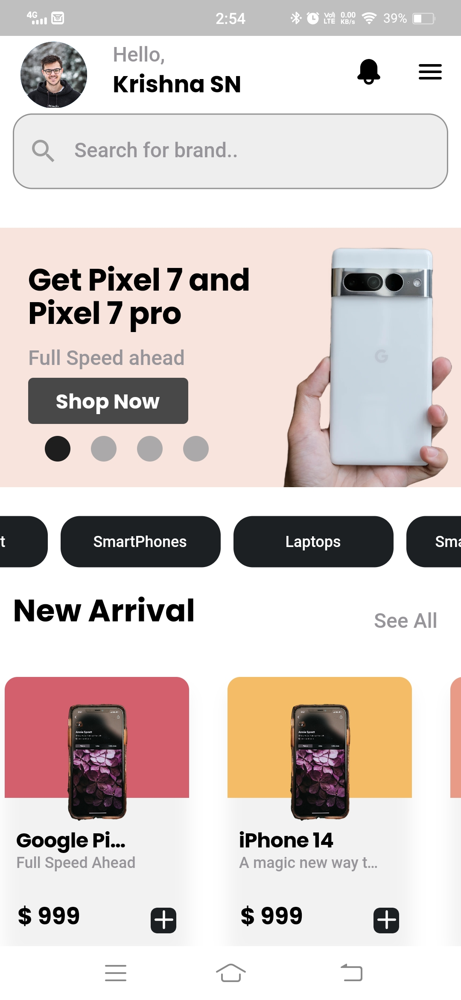
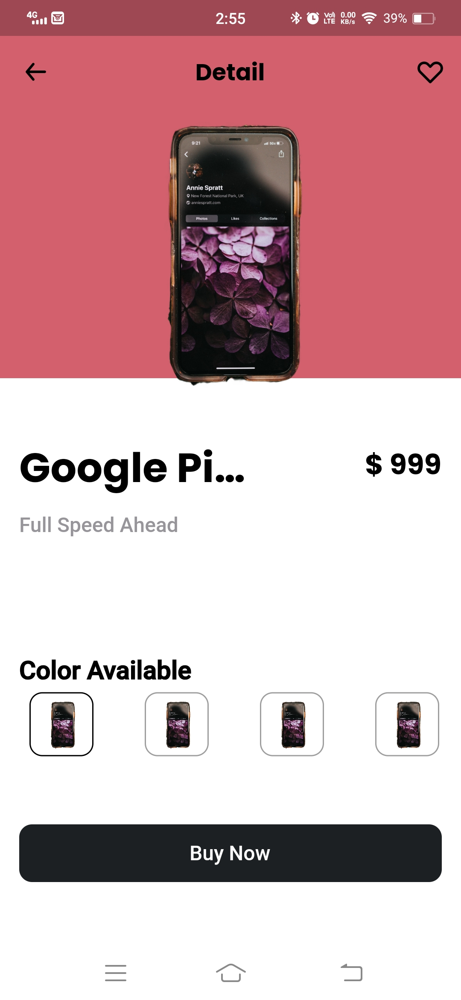
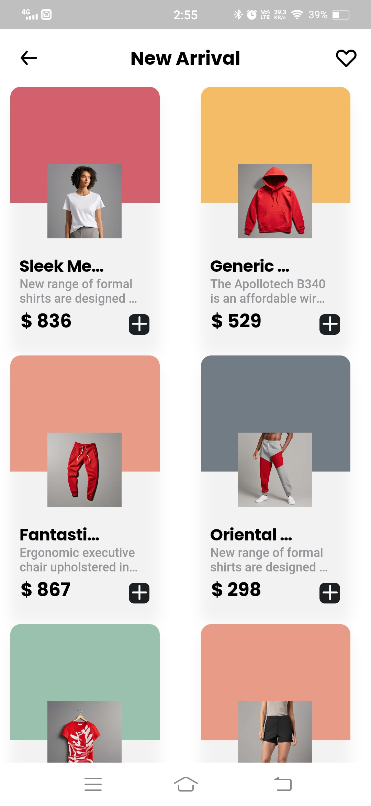
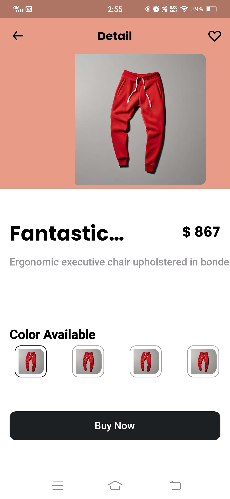

# LiftUp E-Commerce Application

Welcome to the LiftUp E-Commerce Application! This project is a test application designed to assess code quality, state management, and API integration, with optional features including unit tests, integration tests, and a focus on user experience.

## Table of Contents
1. [Introduction](#introduction)
2. [Project Structure](#project-structure)
3. [Package Used](#package-used)
4. [State Management](#state-management)
5. [API Integration](#api-integration)
6. [Optional Features](#optional-features)
7. [Testing](#testing)
8. [User Experience](#user-experience)
9. [Contact info](#Contact-info)


## Introduction

The LiftUp E-Commerce Application is a test project that aims to demonstrate the best practices in developing a high-quality e-commerce application. It emphasizes code quality, efficient state management, and seamless integration with external APIs.

### App Images
<table>
<tr>
<td>  
 <td> 

</tr>
<tr>
 <td> 
<td>  
</tr>
</table>


## Project Structure

This project follows the MVC (Model-View-Controller) architecture pattern, which helps organize and separate concerns in the codebase. The project structure is as follows:

### Controller
- **api**: Manages HTTP requests and interactions with external APIs.
- **navigation**: Handles dynamic routing and navigation within the application.
- **view**: Controls screen events and user interactions.

### Model
- Contains data models that represent structured data used in the application.

### View
- **global**: Contains global elements, styles, and utility widgets that are reused across multiple screens.
- **screen**: Defines individual screens or pages of the application, each responsible for its UI and logic.
- **widgets**: Houses reusable UI components and widgets used in various parts of the application.

This architectural approach promotes code separation and maintainability, making it easier to collaborate and scale the development process. It also enhances the readability and organization of the codebase.


## Package Used
1.  provider: ^6.0.5
2.  http: ^0.13.6
3.  eva_icons_flutter: ^3.1.0
4.  flutter_svg: ^2.0.5
5.  google_fonts: ^4.0.4
6.  collection: ^1.17.0
7.  carousel_slider: ^4.2.1


## State Management

State management is a critical aspect of this application. We use `Provider` to manage application state. Ensure that state is well-organized and accessible to components as needed.

## API Integration

API integration plays a pivotal role in the application's functionality. Make sure that API calls are efficient, error handling is robust, and data is fetched and updated seamlessly.

```dart
import 'dart:convert';

import 'package:http/http.dart' as http;

import '../../model/category.dart';
import '../../model/product/product.dart';

class PlatziApi {
  final http.Client httpClient;
  PlatziApi({http.Client? client}) : httpClient = client ?? http.Client();

  final String baseUrl = 'https://api.escuelajs.co/api/v1/';

  Future<List<Category>> getCategories() async {
    final response = await http.get(Uri.parse('${baseUrl}categories'));
    if (response.statusCode == 200) {
      final List<dynamic> categories = json.decode(response.body);
      return categories.map((category) => Category.fromMap(category)).toList();
    } else {
      throw Exception('Failed to load categories');
    }
  }

  Future<List<Product>> getProduct() async {
    final response = await http.get(Uri.parse('${baseUrl}products'));
    if (response.statusCode == 200) {
      final List<dynamic> products = json.decode(response.body);
      return products.map((product) => Product.fromMap(product)).toList();
    } else {
      throw Exception('Failed to load products');
    }
  }

  Future<List<Product>> getProductsByCategory(int categoryId) async {
    final response =
        await http.get(Uri.parse('${baseUrl}products/?categoryId=$categoryId'));
    if (response.statusCode == 200) {
      final List<dynamic> products = json.decode(response.body);
      return products.map((product) => Product.fromMap(product)).toList();
    } else {
      throw Exception('Failed to load products');
    }
  }

  Future<Product> getProductById(int productId) async {
    final response = await http.get(Uri.parse('${baseUrl}products/$productId'));
    if (response.statusCode == 200) {
      final Map<String, dynamic> product = json.decode(response.body)['data'];
      return Product.fromMap(product);
    } else {
      throw Exception('Failed to load product');
    }
  }

  Future<List<Product>> getProductsBySearch(String query) async {
    final response =
        await http.get(Uri.parse('${baseUrl}products/?title=$query'));
    if (response.statusCode == 200) {
      final List<dynamic> products = json.decode(response.body);
      return products.map((product) => Product.fromMap(product)).toList();
    } else {
      throw Exception('Failed to load products');
    }
  }
}
    
```

## Optional Features

### Testing

I strongly postive to writing unit tests. These tests later help me to build cd/ci pipeline.

```dart
import 'package:flutter_test/flutter_test.dart';
import 'package:http/http.dart' as http;
import 'package:http/testing.dart';
import 'package:liftu_tech_ecommerce_app_with_itern/controller/api/platzi_api.dart';

void main() {
  group('PlatziApi Tests', () {
    late PlatziApi apiService;
    late MockClient mockClient;

    setUp(() {
      mockClient = MockClient((request) async {
        if (request.url.path == '/api/v1/categories') {
          return http.Response(
              '[{"id": 1,"name": "Clothes", "image": "https://i.imgur.com/lVH533g.jpeg", "creationAt": "2023-10-21T04:38:54.000Z", "updatedAt": "2023-10-21T04:38:54.000Z" }]',
              200);
        } else if (request.url.path == '/api/v1/products') {
          return http.Response(
              '[{"id": 25, "title": "Ergonomic Rubber Tuna", "price": 763, "description": "The automobile layout consists of a front-engine design, with transaxle-type transmissions mounted at the rear of the engine and four wheel drive", "images": ["https://i.imgur.com/5iNAL9T.jpeg", "https://i.imgur.com/M3QKiC5.jpeg", "https://i.imgur.com/rUWNzYa.jpeg"], "creationAt": "2023-10-20T03:26:28.000Z", "updatedAt": "2023-10-20T03:26:28.000Z", "category": { "id": 2, "name": "IPhone", "image": "https://i.imgur.com/DumuKkD.jpeg", "creationAt": "2023-10-20T03:26:28.000Z", "updatedAt": "2023-10-20T05:38:12.000Z" }]}',
              200);
        } else {
          return http.Response('Not Found', 404);
        }
      });

      apiService = PlatziApi(client: mockClient);
    });

    test('Test getCategories', () async {
      final categories = await apiService.getCategories();

      expect(categories, isNotNull);
    });

    test('Test getProduct', () async {
      final products = await apiService.getProduct();

      expect(products, isNotNull);
    });

    test('Test getProductsByCategory', () async {
      const categoryId = 1;
      final products = await apiService.getProductsByCategory(categoryId);

      expect(products, isNotNull);
    });

    test('Test getProductsBySearch', () async {
      const query = 'example';
      final products = await apiService.getProductsBySearch(query);

      expect(products, isNotNull);
    });
  });
}


```


### User Experience

The visual design of this application has been meticulously crafted using Figma. This powerful design tool has allowed me to create a visually captivating and user-friendly interface. The design process in Figma focused on incorporating smooth animations, intuitive navigation, and responsive layouts to provide an exceptional user experience. You can explore the application's design in Figma [here](https://www.figma.com/file/NAUX3Yf3lAgRkxqLxrPheF/LiftU-tech?type=design&node-id=0%3A1&mode=design&t=YmFR09ey7g8szGhB-1).

## Contact info
1. Email: [deepeshkalurs@gmail.com](mailto:deepeshkalurs@gmail.com)
2. Linkdein: [Deepesh Kalura](https://www.linkedin.com/in/deepeshkalura/)